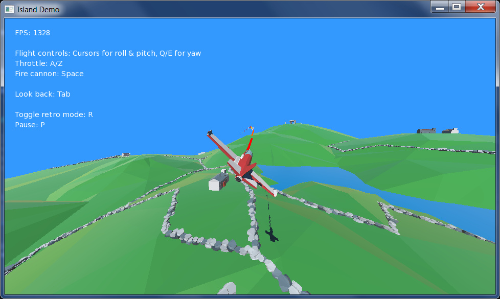
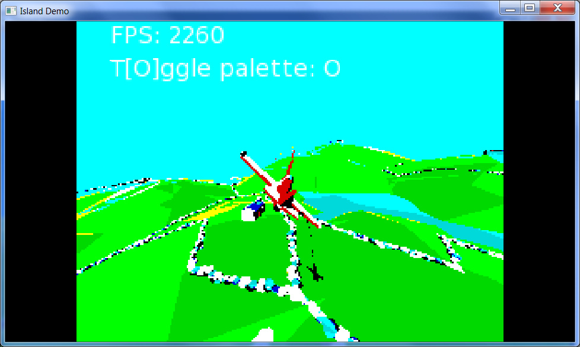

Progression of Island Demo code from blog at http://hi-toro.com/thisdrivel/ to include retro shaders.

Uses palette-matching portions of MAME-PSGS, by Marco Gomez (mgzme): https://github.com/mgzme/MAME-PSGS
License supplied separately as "mame-psgs license.txt".
Thanks, Marco!

Please note: full licensing info for CC0 model assets is contained in island.monkey2; they should not be redistributed without meeting CC0 requirements.

